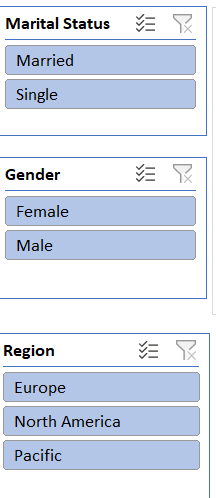
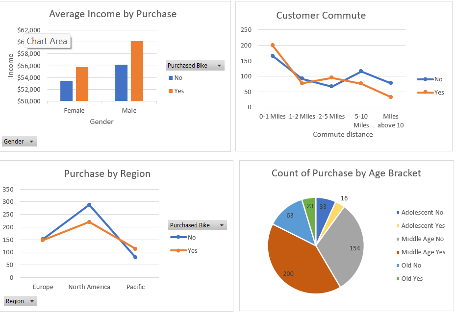
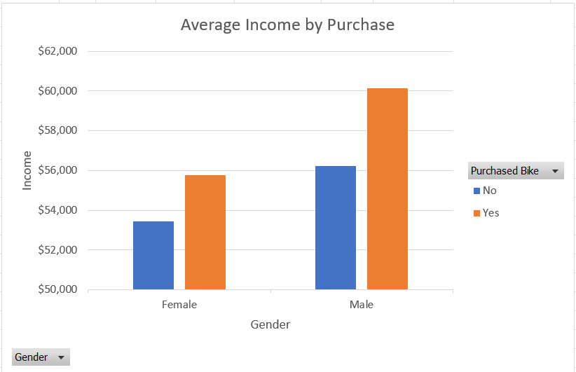

# Bike-Purchase-Project

## Introduction

This Excel projects provides a comprehensive overview of the purchase performance for an imaginary Bike store over a given period of time. The Bike sales dataset was organised and analyzed to answer crucial questions and gain insights to make strategc data driven decisions. This project includes organizing and analyzing purchase transactions, customer information, and product details of these datasets.

This report contains 3 pages:

You can interact with the project [here](https://1drv.ms/x/c/b8e8fdd319a907e1/Ebg3beouaVxHuwkvlOzeNTwBkKoIOB3kNqk36A8UMPK-jw?e=n9lQ7j&nav=MTVfe0QyMTdDMzlDLTZBMkEtNEE1QS04MUQxLUY3N0EwM0E1ODVFQ30)
- Raw dataset
- Worksheet
- Pivot table
- Dashboard

*__Disclaimer__* : **_All dataset or report do no reprsent any Company, Institution or Country but its justa dummy dataset used to demonstrate capabilities of Excel._**

## Problem Statement
- What is the Average income per Customers?
- Which region has the highest impact on the sales?
- What Age bracket purchased bike more?
- What is the Average distance of customers commute?

## Skills / Concept demonstrated
I used Power Query to clean and transform the data while using Power Pivot to analyse and create models. Other tools used includes; slicers, filters, DAX. Leveraging visualization tools, I created charts, graphs, and pivot tables to showcase key Performance metrics.

Filter                     |  Purchase
:------------------------: |  ----------------------------:
   : |  _:

## Analysis
- Average income by purchase :
   
The average income of female customers that purchased bikes is $55,774
The average income of male customers that pirchased bikes is $60,124
This implies that male customers who purchased bikes have a higher income compared to female customers who purchased bikes. 

