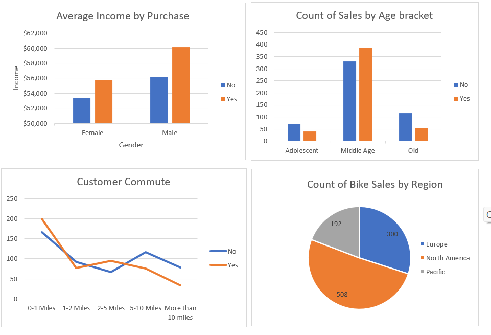
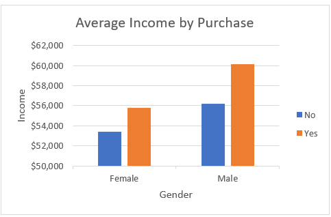
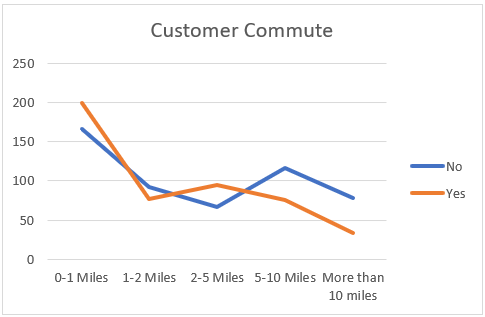
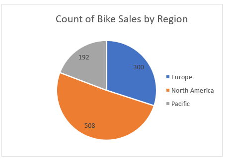
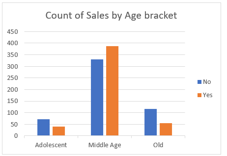

# Goodride Sales Analysis

## Introduction

This Excel projects provides a comprehensive overview of the purchase performance for an imaginary Bike store called **Goodride**, over a given period of time. The Bike sales dataset was organised and analyzed to answer crucial questions and gain insights to make strategc data driven decisions. This project includes organizing and analyzing purchase transactions, customer information, and product details of these datasets.

This report contains 3 pages:

You can interact with the project [here](https://1drv.ms/x/c/b8e8fdd319a907e1/Ebg3beouaVxHuwkvlOzeNTwBkKoIOB3kNqk36A8UMPK-jw?e=n9lQ7j&nav=MTVfe0QyMTdDMzlDLTZBMkEtNEE1QS04MUQxLUY3N0EwM0E1ODVFQ30)
- Raw dataset
- Worksheet
- Pivot table
- Dashboard

*__Disclaimer__* : **_All dataset or report do no represent any Company, Institution or Country but its justa dummy dataset used to demonstrate capabilities of Excel._**

## Problem Statement
- What is the Average income per Customers?
- Which region has the highest impact on the sales?
- What Age bracket purchased bike more?
- What is the Average distance of customers commute?

## Skills / Concept demonstrated
I used Power Query to clean and transform the data while using Power Pivot to analyse and create models. Other tools used includes; slicers, filters, DAX. Leveraging visualization tools, I created charts, graphs, and pivot tables to showcase key Performance metrics.

Filter                     |  Purchase
:------------------------: |  ----------------------------:
   : |  _:

## Analysis
- Average income by purchase

:
   
This chart shows that the male customers who bought bikes have a higher average income ($60,124) than female customers who made similar purchases, with an average income of $55,774.

- Customers Commute

  
This chart shows that most bike customers (200) commute between o-1 mile daily. 

- Sales by region
  

  
 This chart shows that North America has the highest no of customers (508), followed by Europe (300) and the pacific (196) respectively.

- sales by Age bracket
  

This chart shows that the Age bracket of the stores customers are middle aged (>31years), followed by the old (>55years) and the young (<31years) respectively. 

